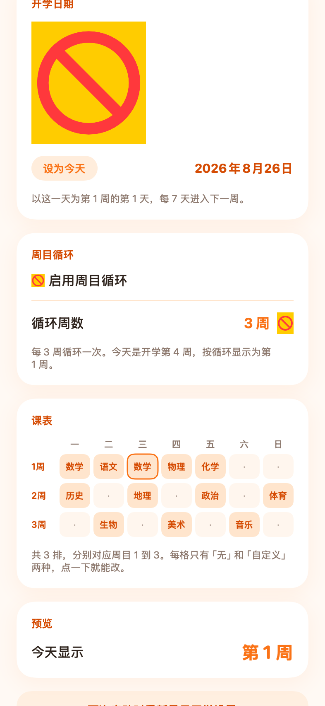
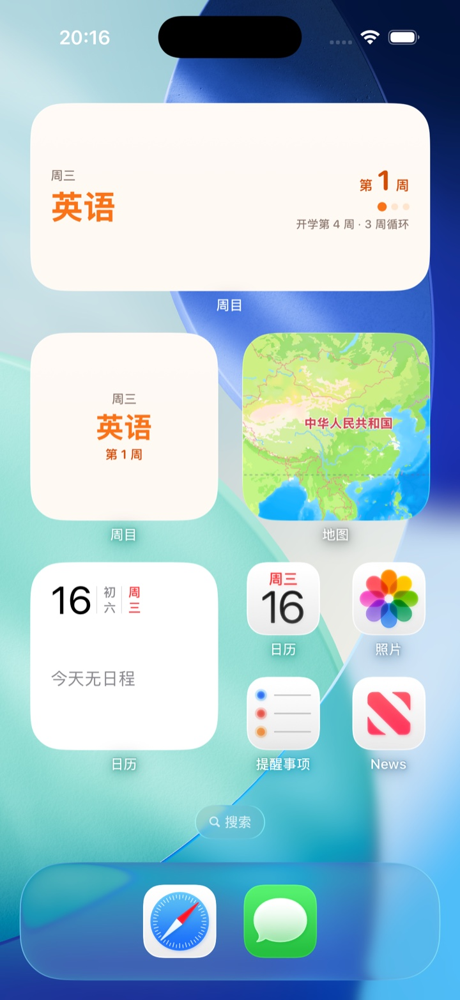

# 周目

**打开就知道今天是第几周、今天上什么课。**

一个极简的 iOS App + 桌面小组件：按你的开学日期和「周目循环」算周目，支持正课表 / 晚课表、灵动岛提醒。

浅色白蓝、深色黑蓝、**不联网、不要账号、不收集任何数据**。

| 主界面 | 课表 | 桌面小组件 |
| :---: | :---: | :---: |
|  |  |  |

---

## 功能

### 周目
- **打开直接显示**：圈内是当前科目，圈下面是「第 N 周」，圆环按**课程完成进度**填充。
- **开学日期**：以这天为第 1 周的第 1 天，每 7 天进入下一周。
- **周目循环**：开启后按 N 周循环显示（N 可选 1–20 周）。

### 两张课表
- **正课表** 与 **晚课表**互相独立，可各自开启或**单独关闭**。
- 覆盖周一至周日，**每天节数可以不一样**（1–12 节）。
- 每张表可以选 **固定**（每周同一份）或 **按周目轮换**（每周换一排）。
- 每格只有「无」和「自定义」两个选项。
- 每节可**选填上下课时间**——不填也能用，只是不参与时间轴和提醒。

### 首页两页
- **第一页**：圆环 + 周目 + 三行信息 —— 距下节课还有多久 / 这节还有多久结束 / 下节是什么。
- **第二页**：当天完整课表，当前这节高亮标「进行中」。
- 圆环在上课时按本节进度走，**课间休息时环是闭合的**，每节课结束后重新开始。

### 灵动岛
- 上课中 / 课间 / 快下课时，灵动岛和锁屏显示当前科目与倒计时。
- **每节课上课前 5 分钟、下课前 5 分钟各提醒一次**，提醒里带下节课名。
- 倒计时和进度条由系统渲染，**App 没在运行也不会停**。
- 没填时间的节次不参与提醒（首页圈内则回退显示当日晚课）。

### 其他
- **浅色 / 深色 / 跟随系统** 三态外观切换。
- 不联网、不要账号、不收集任何数据。

u-1.2-unsigned.ipa`，
用 Sideloadly / AltStore / ESign 等工具自签安装。

> ⚠️ **两个必读的坑**
>
> 1. **小组件需要重新签名**。这个 IPA 里含小组件扩展 `PlugIns/ZhouMuWidget.appex`，
>    自签工具必须把它一起重签，否则小组件用不了。装完长按桌面 ▸「+」搜「周目」能搜到就说明签上了。
> 2. **用了自签工具后，小组件可能读不到 App 的设置**。App 与小组件平时通过 App Group 共享设置，
>    而自签工具不会去注册这个能力。这种情况小组件会**自动回退**成只显示周目，
>    你可以**长按小组件 ▸ 编辑小组件**手动填开学日期。
>
> 另外，用免费 Apple ID 自签**同样只有 7 天**，不会变长。那些「企业证书」能到 1 年，
> 但属于 Apple 明令禁止的用途，证书随时会被吊销、所有装过的人一起失效，不建议用。

### 方式三：上架 / TestFlight

需要付费开发者账号（99 美元/年）。在 Xcode 里 **Product ▸ Archive** 然后上传到 App Store Connect，
或者用 `./Tools/release.sh`（构建号会自动递增）。

> 想长期公开分发的话，上架 App Store 比 TestFlight 合适 —— TestFlight 的构建只有 **90 天**寿命，
> 到期要重新上传，否则所有人打开都会提示「Beta 已过期」。

---

## 自己编译

```bash
open ZhouMu.xcodeproj
```

### 1. 必须改 Bundle ID

`com.zhoumu.weekdisplay` **已经被占用**（Bundle ID 全球唯一，注册在作者账号下），你必须换成自己的：

打开 `ZhouMu.xcodeproj/project.pbxproj`，找到并修改这一处：

```
APP_BUNDLE_ID = com.zhoumu.weekdisplay;
```

改成例如 `com.yourname.zhoumu`。**App 和小组件的 Bundle ID 会自动同步**
（小组件是 `$(APP_BUNDLE_ID).widget`），App Group 也会跟着变成 `group.com.yourname.zhoumu`。

### 2. 选签名团队

> ⚠️ 工程里带着**作者的 Team ID**（`M39NNXS7CK`），这是为了让 App Group 能正常注册。
> **你必须换成自己的**，否则会报「no profiles for ...」。

1. Xcode ▸ 选中 **ZhouMu** target ▸ **Signing & Capabilities** ▸ **Team** 改成你自己的账号
2. **小组件 target（ZhouMuWidget）也要选同一个 Team**，否则会报 `requires a development team`

改完之后 Xcode 会把新的 Team ID 写回 `project.pbxproj`（`TargetAttributes` 里 2 处 +
`DEVELOPMENT_TEAM` 4 处），直接提交即可。

> 如果你 fork 之后想彻底不带作者信息，也可以把这几处的值删成空字符串，
> 代价是每次重新 clone 都要在 Xcode 里手动选一次 Team。

### 3. 如果报 App Group 相关错误

工程用了 App Group 让 App 和小组件共享设置。**如果这个 App ID 之前已经注册过，
需要先在门户里把 App Group 关联上**，Xcode 命令行做不到这一点：

1. 在 Xcode 里打开工程，选中 **ZhouMu** target ▸ **Signing & Capabilities**
2. 会看到一条红色的签名错误 → 点 **Fix Issue**（或在 **+ Capability** 里加 **App Groups**，
   填 `group.<你的 Bundle ID>`）
3. Xcode 会把它注册到你的开发者账号，之后就能正常编译了

> **如果你完全不想要 App Group**（比如只打算自签分发给别人，反正也用不上）：
> 删掉工程根目录的 `ZhouMu.entitlements`、`ZhouMuWidget.entitlements`，
> 以及 `project.pbxproj` 里 4 处 `CODE_SIGN_ENTITLEMENTS = ...;`。
> 小组件会自动回退到「长按小组件手动设置」的模式，功能不受影响。

---

## 项目结构

```
ZhouMu.xcodeproj/            工程文件
ZhouMu/                      主 App
  ZhouMuApp.swift              入口
  Models/AppSettings.swift     设置读写 + 启动弹窗规则 + 课表存取
  Views/HomeView.swift         主界面：今天第几周 / 上什么课
  Views/SettingsView.swift     设置：开学日期 + 周目循环 + 课表 + 预览
  Assets.xcassets/             图标 / 强调色
  PrivacyInfo.xcprivacy        隐私清单（上架 / TestFlight 需要）
ZhouMuWidget/                桌面小组件
  ZhouMuWidget.swift           时间线、界面、回退配置
Shared/                      App 与小组件共用
  SemesterCalculator.swift     周目计算（纯逻辑，可单独测试）
  SharedStorage.swift          App Group 共享存储
  Palette.swift                橙白配色
ZhouMu.entitlements          App Group 声明（App 侧）
ZhouMuWidget.entitlements    App Group 声明（小组件侧）
Screenshots/                 截图
Tools/                       开发脚本，见下
```

> 打好的 IPA 不放在仓库里，通过 **[Releases](../../releases)** 分发（二进制不进 git 历史）。

## 开发与校验

所有校验都**不需要真机和模拟器**：

```bash
./Tools/verify.sh          # 97 项断言 + App/小组件编译检查 + 生成图标
./Tools/render_ui.sh       # 把主界面、设置页渲染成 PNG
./Tools/render_widget.sh   # 把小组件渲染成 PNG
./Tools/device_check.sh    # 检查「装到自己 iPhone」还缺什么
./Tools/make_ipa.sh        # 打无签名 IPA
```

`Tools/CalculatorCheck/main.swift` 是 **97 项断言**的逻辑校验，覆盖：

- 循环取模（含「开学第 4 周 + 循环 3 周 = 第 1 周」）
- 开学当天、关闭循环、循环 1 周、未开学
- 长期使用（第 30 周）、跨夏令时不会算错天数
- 课表的星期索引、排索引、存取、持久化、「今天取哪一格」
- 1 月 / 7 月与首次启动的弹窗规则

## 常见问题

**Q：为什么圈内显示「无课」？**
A：课表里今天那一格是空的。去设置 ▸ 课表点一下那格填上科目。

**Q：小组件里搜不到「周目」？**
A：先打开一次 App（让系统注册扩展）。如果你是用自签工具装的，说明小组件扩展没被重签。

**Q：小组件显示的和 App 里不一样 / 一直显示「第 ? 周」？**
A：说明 App Group 没生效（常见于自签安装）。长按小组件 ▸ 编辑小组件手动设置开学日期即可。

**Q：7 天后 App 打不开了？**
A：免费 Apple ID 签的 App 只有 7 天。连上电脑重新 ⌘R 一次，数据不丢。

**Q：改开学日期后小组件没立刻变？**
A：App 里改设置会立刻通知小组件刷新；如果 App 已被系统杀掉，小组件会在下一个零点自己重算。

## 许可证

[MIT](LICENSE)
