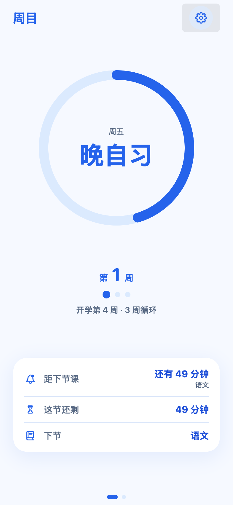
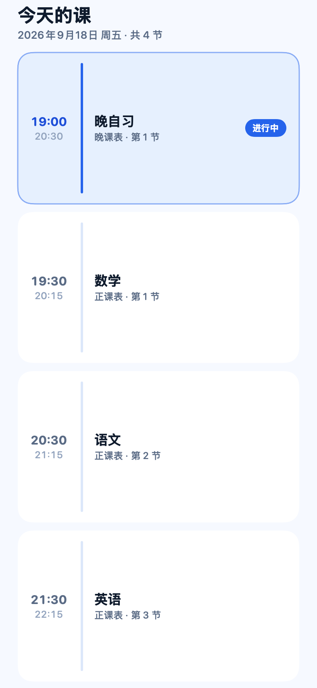
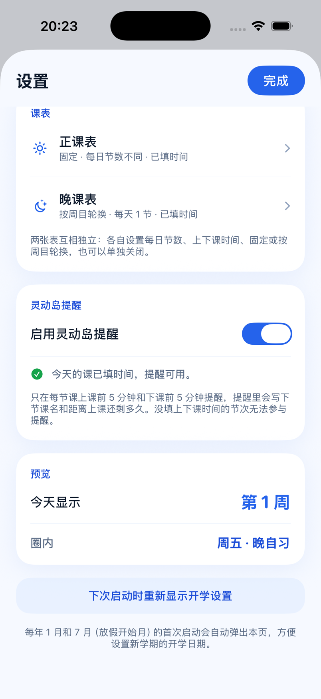
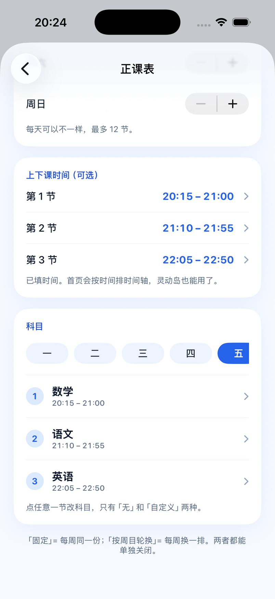
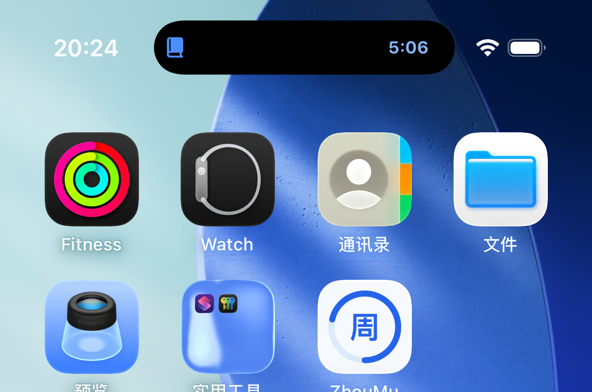
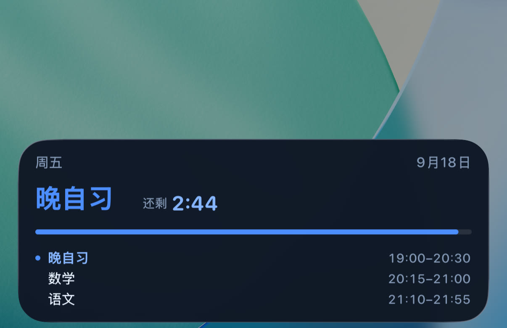
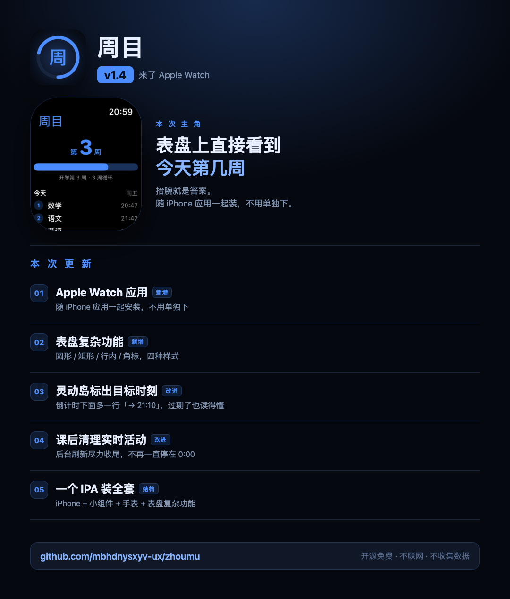

# 周目

**打开就知道今天是第几周、今天上什么课。**

一个极简的 iOS App + 桌面小组件：按你的开学日期和「周目循环」算周目，支持正课表 / 晚课表、灵动岛提醒。

浅色白蓝、深色黑蓝，**不联网、不要账号、不收集任何数据**。

| 第一页 | 第二页 | 设置 |
| :---: | :---: | :---: |
|  |  |  |

| 课表编辑器 | 桌面小组件 |
| :---: | :---: |
|  |  |

| 灵动岛 | 锁屏实时活动 |
| :---: | :---: |
|  |  |

> 以上都是**模拟器实拍**（iPhone 17 Pro / iOS 26.5），不是设计稿。

---

## 功能

### 周目

- **打开直接显示**：圈内是当前科目，圈下面是「第 N 周」，圆环按**课程完成进度**填充。
- **开学日期**：以这天为第 1 周的第 1 天，每 7 天进入下一周。
- **周目循环**：开启后按 N 周循环显示（N 可选 1–20 周）。

### 两张课表

- **正课表** 与 **晚课表**互相独立，可各自开启或**单独关闭**。
- 覆盖周一至周日，**每天节数可以不一样**（1–12 节）。
- 每张表可以选 **固定**（每周同一份）或 **按周目轮换**（每周换一排）。
- 每格只有「无」和「自定义」两个选项。
- 每节可**选填上下课时间**——不填也能用，只是不参与时间轴和提醒。

### 首页两页

- **第一页**：圆环 + 周目 + 三行信息 —— 距下节课还有多久 / 这节还有多久结束 / 下节是什么。
- **第二页**：当天完整课表，当前这节高亮标「进行中」。
- 圆环在上课时按本节进度走，**课间休息时环是闭合的**，每节课结束后重新开始。

### 灵动岛

- 上课中 / 课间 / 快下课时，灵动岛和锁屏显示当前科目与倒计时。
- **每节课上课前 5 分钟、下课前 5 分钟各提醒一次**，提醒里带下节课名。
- 倒计时和进度条由系统渲染，**App 没在运行也不会停**。
- 没填时间的节次不参与提醒，此时首页圈内会**回退显示当天晚课表的科目**（小字标「当日晚课」）。

### Apple Watch

- 手表应用**随 iPhone 应用一起安装**，不用单独装。
- **第 N 周**大字显示 + 本周进度条，下面列出今天的课。
- **表盘复杂功能**四种样式：圆形（进度环 + 周目）、矩形、行内、角标。
- 手表上有自己的设置：开学日期、循环周数、今天各节科目。

### 其他

- **浅色 / 深色 / 跟随系统** 三态外观切换，App 图标也有深浅两个版本。
- 不联网、不要账号、不收集任何数据。

---

## 计算规则

```
距开学天数 = 今天 - 开学日期（按自然日）
开学第 rawWeek 周 = 距开学天数 / 7 + 1          (整除)
显示周目 = (rawWeek - 1) % 循环周数 + 1         (开启循环)
         = rawWeek                              (关闭循环)
```

举例（开学 2026-02-23，循环 3 周）：

| 日期 | 距开学 | 开学第几周 | 显示 |
| --- | --- | --- | --- |
| 02-23 | 0 天 | 第 1 周 | **第 1 周** |
| 03-16 | 21 天 | 第 4 周 | **第 1 周** |
| 03-23 | 28 天 | 第 5 周 | **第 2 周** |
| 03-30 | 35 天 | 第 6 周 | **第 3 周** |
| 04-06 | 42 天 | 第 7 周 | **第 1 周** |

即「开学第 4 周、循环 3 周 → 该日为第 1 周」。

### 课表怎么对应

两张表各自取排：

```
今天显示第几周 → 用第几排        （「固定」时恒用第 1 排）
今天是周几     → 用那一排的第几列
当天第几节     → 用那一列的第几节（每天节数可以不同）
```

所以开学第 4 周（循环 3 周 → 显示第 1 周）会自动回到**第 1 排**取科目。格子留空（= 无）时圈内显示「无课」。

**首页和灵动岛**会把两张表里**填了时间的节次**按时间合并排序，取此刻正在进行的那一节；课间则预告下一节。**一节时间都没填**时排不出时间轴，圈内就回退成显示当天晚课表的科目。

---

## 下载安装

### 方式一：装到自己的 iPhone（用 Xcode，免费 Apple ID）

不需要开发者账号，完整步骤见 **[装到自己的iPhone.md](装到自己的iPhone.md)**。

> 免费账号签出来的 App **7 天后失效**，重新连电脑跑一次就行（数据不丢）。这是 Apple 的限制，绕不过去。

### 方式二：用自签工具装（下载 Release 里的 IPA）

到 **[Releases](../../releases/latest)** 页面下载 `ZhouMu-1.3-unsigned.ipa`，
用 Sideloadly / AltStore / ESign 等工具自签安装。

> ⚠️ **两个必读的坑**
>
> 0. **手表应用在这个 IPA 里**：`Watch/ZhouMuWatch.app`（含表盘复杂功能）。
>    它随 iPhone 应用一起安装，不用单独下。不过自签工具**未必会重签手表那部分**，
>    见下面第 1 条同样的注意事项。
>
> 1. **小组件需要重新签名**。这个 IPA 里含小组件扩展 `PlugIns/ZhouMuWidget.appex`，
>    自签工具必须把它一起重签，否则小组件用不了。装完长按桌面 ▸「+」搜「周目」能搜到就说明签上了。
> 2. **用了自签工具后，小组件可能读不到 App 的设置**。App 与小组件平时通过 App Group 共享设置，
>    而自签工具不会去注册这个能力。这种情况小组件会**自动回退**成手动配置模式，
>    你可以**长按小组件 ▸ 编辑小组件**手动填开学日期。
>
> 另外，用免费 Apple ID 自签**同样只有 7 天**，不会变长。那些「企业证书」能到 1 年，
> 但属于 Apple 明令禁止的用途，证书随时会被吊销、所有装过的人一起失效，不建议用。

### 方式三：上架 / TestFlight

需要付费开发者账号（99 美元/年）。在 Xcode 里 **Product ▸ Archive** 然后上传到 App Store Connect，
或者用 `./Tools/release.sh`（构建号会自动递增）。

> 想长期公开分发的话，上架 App Store 比 TestFlight 合适 —— TestFlight 的构建只有 **90 天**寿命，
> 到期要重新上传，否则所有人打开都会提示「Beta 已过期」。

---

## 自己编译

```bash
open ZhouMu.xcodeproj
```

### 1. 必须改 Bundle ID

`com.zhoumu.weekdisplay` **已经被占用**（Bundle ID 全球唯一，注册在作者账号下），你必须换成自己的：

打开 `ZhouMu.xcodeproj/project.pbxproj`，找到并修改这一处：

```
APP_BUNDLE_ID = com.zhoumu.weekdisplay;
```

改成例如 `com.yourname.zhoumu`。**App 和小组件的 Bundle ID 会自动同步**
（小组件是 `$(APP_BUNDLE_ID).widget`），App Group 也会跟着变成 `group.com.yourname.zhoumu`。

### 2. 选签名团队

> ⚠️ 工程里带着**作者的 Team ID**（`M39NNXS7CK`），这是为了让 App Group 能正常注册。
> **你必须换成自己的**，否则会报「no profiles for ...」。

1. Xcode ▸ 选中 **ZhouMu** target ▸ **Signing & Capabilities** ▸ **Team** 改成你自己的账号
2. **小组件 target（ZhouMuWidget）也要选同一个 Team**，否则会报 `requires a development team`

改完之后 Xcode 会把新的 Team ID 写回 `project.pbxproj`（`TargetAttributes` 里 2 处 +
`DEVELOPMENT_TEAM` 4 处），直接提交即可。

> 如果你 fork 之后想彻底不带作者信息，也可以把这几处的值删成空字符串，
> 代价是每次重新 clone 都要在 Xcode 里手动选一次 Team。

### 3. 如果报 App Group 相关错误

工程用了 App Group 让 App 和小组件共享设置。**如果这个 App ID 之前已经注册过，
需要先在门户里把 App Group 关联上**，Xcode 命令行做不到这一点：

1. 在 Xcode 里打开工程，选中 **ZhouMu** target ▸ **Signing & Capabilities**
2. 会看到一条红色的签名错误 → 点 **Fix Issue**（或在 **+ Capability** 里加 **App Groups**，
   填 `group.<你的 Bundle ID>`）
3. Xcode 会把它注册到你的开发者账号，之后就能正常编译了

> **如果你完全不想要 App Group**（比如只打算自签分发给别人，反正也用不上）：
> 删掉工程根目录的 `ZhouMu.entitlements`、`ZhouMuWidget.entitlements`，
> 以及 `project.pbxproj` 里 4 处 `CODE_SIGN_ENTITLEMENTS = ...;`。
> 小组件会自动回退到「长按小组件手动设置」的模式，功能不受影响。

> **灵动岛需要 `NSSupportsLiveActivities`**。这个开关已经在工程里配好了
> （`project.pbxproj` 里 4 处 `INFOPLIST_KEY_NSSupportsLiveActivities = YES`），
> 换成你自己的 Bundle ID 后不用动。注意实时活动**只在 iPhone 14 Pro 及以后的机型**上有灵动岛，
> 其他机型只在锁屏显示。

---

## 项目结构

```
ZhouMu.xcodeproj/            工程文件
ZhouMu/                      主 App
  ZhouMuApp.swift              入口（应用外观模式）
  Models/
    AppSettings.swift            设置读写 + 启动弹窗规则 + 两张课表
    LiveActivityManager.swift    灵动岛实时活动 + 上下课提醒
  Views/
    HomeView.swift               第一页：圆环 + 周目 + 三行倒计时
    TodayScheduleView.swift      第二页：当日完整课表
    SettingsView.swift           设置首页：外观 / 学期 / 课表入口 / 灵动岛
    ScheduleEditorView.swift     单张课表编辑器（含科目与时间编辑）
    ThemeSupport.swift           主题落地 + 时长文案 + 卡片样式
  Assets.xcassets/             图标（浅色 + 深色两版）
  PrivacyInfo.xcprivacy        隐私清单（上架 / TestFlight 需要）
ZhouMuWidget/                桌面小组件 + 灵动岛
  ZhouMuWidget.swift           时间线、小组件界面、ActivityConfiguration、回退配置
ZhouMuWatch/                 Apple Watch 应用（随 iPhone 应用一起装）
  ZhouMuWatchApp.swift         入口
  Models/WatchSettings.swift   手表端设置
  Views/WeekView.swift         第 N 周 + 今天的课
  Views/WatchSettingsView.swift 手表端设置页
ZhouMuWatchWidget/           表盘复杂功能
  ZhouMuWatchWidget.swift      circular / rectangular / inline / corner
Shared/                      App 与小组件共用
  SemesterCalculator.swift     周目计算（纯逻辑，可单独测试）
  ScheduleModel.swift          两张课表的数据模型 + 时间轴合并 + 状态机
  ClassActivity.swift          实时活动的数据契约（ActivityAttributes）
  Theme.swift                  配色（浅色白蓝 / 深色黑蓝，动态色）
  WatchStorage.swift           手表端与复杂功能共享的存储
  SharedStorage.swift          App Group 共享存储
ZhouMu.entitlements          App Group 声明（App 侧）
ZhouMuWidget.entitlements    App Group 声明（小组件侧）
Screenshots/                 截图 + 更新公告图
Tools/                       开发脚本，见下
```

> 打好的 IPA 不放在仓库里，通过 **[Releases](../../releases)** 分发（二进制不进 git 历史）。

## 开发与校验

所有校验都**不需要真机和模拟器**：

```bash
./Tools/verify.sh          # 150 项断言 + App/小组件编译检查 + 实时活动开关检查 + 生成图标
./Tools/render_ui.sh       # 把首页、第二页、设置页、课表编辑器渲染成 PNG（含深色）
./Tools/render_widget.sh   # 把小组件渲染成 PNG
./Tools/device_check.sh    # 检查「装到自己 iPhone」还缺什么
./Tools/make_ipa.sh        # 打无签名 IPA
```

`Tools/CalculatorCheck/main.swift` 是 **150 项断言**的逻辑校验，覆盖：

- 循环取模（含「开学第 4 周 + 循环 3 周 = 第 1 周」）
- 开学当天、关闭循环、循环 1 周、未开学
- 长期使用（第 30 周）、跨夏令时不会算错天数
- **两张课表**：独立存取、每日节数上下限夹紧、时间的合法性校验
- **时间轴合并**：固定表不随周目变、轮换表按周目取排、关闭的表完全不参与
- **状态机**：上课中 / 课间 / 完课，以及环进度（课间闭合为 1）
- **当日晚课回退**：两张表都没时间时圈内显示什么
- **v1.2 → v1.3 迁移**：旧课表搬进晚课表
- 主题模式的三态与持久化
- 1 月 / 7 月与首次启动的弹窗规则

## 常见问题

**Q：为什么圈内显示「无课」？**
A：两张课表里今天都没有课。去设置 ▸ 课表点一下那格填上科目。

**Q：圈内为什么不显示「现在上什么」，而是显示「当日晚课」？**
A：因为这两张表**一节上下课时间都没填**。没有时间就排不出时间轴，所以退而显示当天晚课表的科目。
去设置 ▸ 课表 ▸ 上下课时间填上（至少今天要上的那几节），首页就会显示当前科目、三行倒计时和灵动岛提醒。

**Q：灵动岛 / 锁屏没有实时活动？**
A：三个前提：① 设置里「启用灵动岛提醒」是开的；② 今天至少有一节填了时间；③ 机型支持
（灵动岛需要 iPhone 14 Pro 及以后，其他机型只在锁屏显示）。另外这个功能需要小组件扩展被正确安装。

**Q：下课时间到了，灵动岛为什么没有自己消失？**

A：这是 iOS 的限制，不是 bug。翻苹果 [ActivityKit 文档](https://developer.apple.com/documentation/activitykit/activityuidismissalpolicy) 能看到两条关键事实：

- `end(_:dismissalPolicy: .after(时间))` 能安排自动移除，但**它会让活动立刻从灵动岛消失**，只有锁屏会保留到那个时间。所以不能用它来「到时再消失」——那样整节课灵动岛都是空的（实测验证过）。
- 想在精确时刻远程结束活动，苹果给的正规途径是 **APNs 的 push-to-end**，也就是需要一台服务器。

没有服务器的情况下，本 App 的做法是：

1. **上课期间保持活动状态**，灵动岛正常显示；
2. **内容设为下课时过期**（`staleDate`），到点后系统会把卡片变暗，表示「这条已经过时」；
3. **倒计时下面标出目标时刻**（`→ 21:10`），所以过期后读到的是「还剩 0:00 / → 21:10」——
   是「已经到点了」，而不是一个坏掉的计时器；
4. **排一个后台刷新任务**（`BGAppRefreshTask`），让系统在课后**找机会**唤醒 App 去把活动结束掉；
5. **打开 App 时立即追平**：这节上完就换成当前该显示的，当天全上完则直接移除。

> 第 4 条是「尽力而为」：`earliestBeginDate` 只是「最早可以开始」，
> iOS 会按电量、网络、使用习惯自行排期，可能课后几分钟就跑，也可能拖很久。
> 想要**精确到秒**，只能用 APNs 的 push-to-end，那需要付费开发者账号和一台服务器。

**Q：小组件里搜不到「周目」？**
A：先打开一次 App（让系统注册扩展）。如果你是用自签工具装的，说明小组件扩展没被重签。

**Q：小组件显示的和 App 里不一样 / 一直显示「第 ? 周」？**
A：说明 App Group 没生效（常见于自签安装）。长按小组件 ▸ 编辑小组件手动设置开学日期即可。

**Q：7 天后 App 打不开了？**
A：免费 Apple ID 签的 App 只有 7 天。连上电脑重新 ⌘R 一次，数据不丢。

**Q：改开学日期后小组件没立刻变？**
A：App 里改设置会立刻通知小组件刷新；如果 App 已被系统杀掉，小组件会在下一个零点自己重算。

## 更新日志

当前版本 **1.4**，完整记录见 **[CHANGELOG.md](CHANGELOG.md)**。



## 许可证

[MIT](LICENSE)
